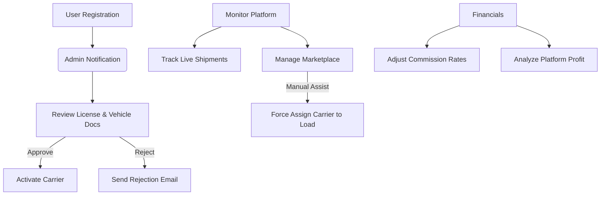

# Admin Workflow - WaselX

This document outlines the core journey of a Platform Administrator on the WaselX Dashboard.

## Key Responsibilities
1.  **Safety & Trust**: Verifying Carriers and their legal documents.
2.  **Market Stability**: Monitoring open shipments to ensure they get bids.
3.  **Support**: Manually assigning carriers if a shipper is struggling to find one.
4.  **Growth**: Adjusting platform fees and analyzing volume trends.
