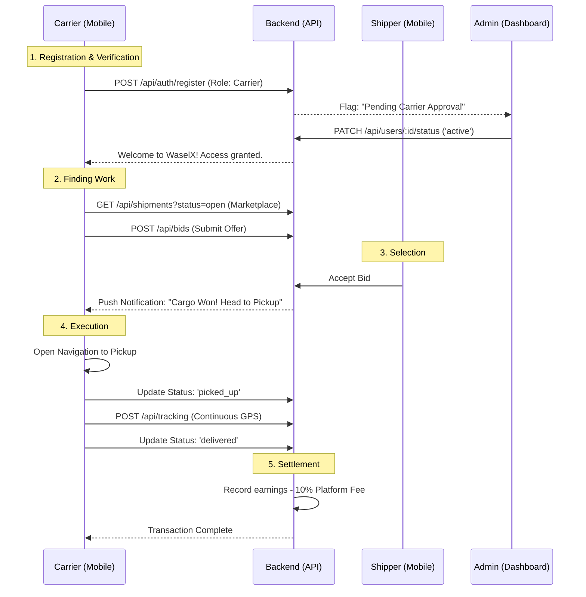

# Carrier Workflow - WaselX

This document outlines the core journey of a Carrier (Driver/Company) on the WaselX platform.

## Key States
- **PENDING**: Registered but waiting for Admin to verify license/vehicle.
- **ACTIVE**: Ready to bid on shipments.
- **ON_TRIP**: Currently assigned to a load.
- **SUSPENDED**: Account locked by admin (policy violation).
