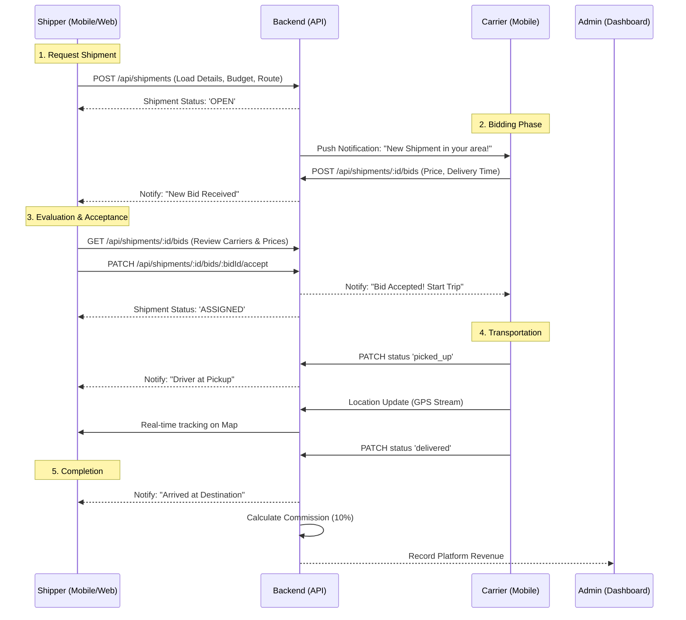

# Shipper Workflow - WaselX

This document outlines the core journey of a Shipper (Customer) on the WaselX platform.

## Key States
- **OPEN**: Shipment created, waiting for bids.
- **BIDDING**: Bids are coming in.
- **ASSIGNED**: Shipper has chosen a carrier.
- **IN_TRANSIT**: Goods are on the move.
- **DELIVERED**: Trip finished.
